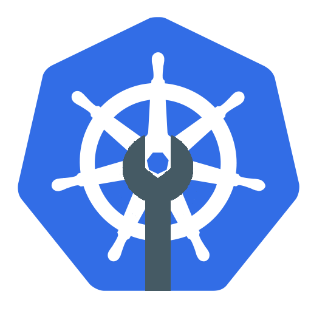

[![Contributors][contributors-shield]][contributors-url]
[![Forks][forks-shield]][forks-url]
[![Stargazers][stars-shield]][stars-url]
[![Issues][issues-shield]][issues-url]
[![MIT License][license-shield]][license-url]

<!-- PROJECT LOGO -->
 

  

  <h3 align="center">Shipwright</h3>

  

    Cycle latest pods in Kubernetes development clusters.
     
    <a href="https://dynulo.github.io/Shipwright"><strong>Explore the docs »</strong></a>
     
     
    <a href="https://github.com/dynulo/Shipwright/issues">Report Bug</a>
    ·
    <a href="https://github.com/dynulo/Shipwright/issues">Request Feature</a>
  

<!-- TABLE OF CONTENTS -->
## Table of Contents

* [About the Project](#about-the-project)
* [Getting Started](#getting-started)
* [Usage](#usage)
* [Roadmap](#roadmap)
* [Contributing](#contributing)
* [License](#license)

<!-- ABOUT THE PROJECT -->
## About The Project

A simple tool for Kubernetes development clusters. It cycles your pods to use the latest version of each docker image by periodocially checking against the repository.

This is intended for use with development clusters where a `latest` or similar tag is used. By using Shipwright to pull new images rather than have a deploy system that pushes to the cluster, new dev clusters can be quickly spun up and down without modifiying the build pipeline.

<!-- GETTING STARTED -->
## Getting Started

### Prerequisites

Kubernetes 1.17+

Any pod you wish to be cycled by Shipwright must have `imagePullPolicy: Always`

### Installation

Helm chart and all-in-one deploy file coming soon

<!-- USAGE EXAMPLES -->
## Usage

Environment Variables:

*SHIPWRIGHT_NAMESPACES* - Namespaces for Shipwright to check, if left empty it will only check the namespace it is deployed to.

*SHIPWRIGHT_INTERVAL* - Interval to check pods in seconds, defaults to 60

_For more information, please refer to the [Documentation](https://dynulo.github.io/shipwright)_

<!-- ROADMAP -->
## Roadmap

See the [open issues](https://github.com/dynulo/Shipwright/issues) for a list of proposed features (and known issues).

<!-- CONTRIBUTING -->
## Contributing

Contributions are what make the open source community such an amazing place to be learn, inspire, and create. Any contributions you make are **greatly appreciated**.

1. Fork the Project
2. Create your Feature Branch (`git checkout -b feature/AmazingFeature`)
3. Commit your Changes (`git commit -m 'Add some AmazingFeature'`)
4. Push to the Branch (`git push origin feature/AmazingFeature`)
5. Open a Pull Request

<!-- LICENSE -->
## License

Distributed under the MIT License. See `LICENSE` for more information.

<!-- CONTACT -->
## Contact

Project Link: [https://github.com/dynulo/shipwright](https://github.com/dynulo/shipwright)

<!-- MARKDOWN LINKS & IMAGES -->
<!-- https://www.markdownguide.org/basic-syntax/#reference-style-links -->
[contributors-shield]: https://img.shields.io/github/contributors/dynulo/Shipwright.svg?style=flat-square
[contributors-url]: https://github.com/dynulo/Shipwright/graphs/contributors
[forks-shield]: https://img.shields.io/github/forks/dynulo/Shipwright.svg?style=flat-square
[forks-url]: https://github.com/dynulo/Shipwright/network/members
[stars-shield]: https://img.shields.io/github/stars/dynulo/Shipwright.svg?style=flat-square
[stars-url]: https://github.com/dynulo/Shipwright/stargazers
[issues-shield]: https://img.shields.io/github/issues/dynulo/Shipwright.svg?style=flat-square
[issues-url]: https://github.com/dynulo/Shipwright/issues
[license-shield]: https://img.shields.io/github/license/dynulo/Shipwright.svg?style=flat-square
[license-url]: https://github.com/dynulo/Shipwright/blob/master/LICENSE.txt
